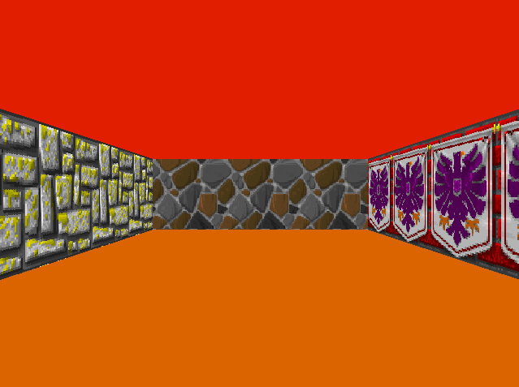

# cub3D

This 2-people group project is part of the curriculum at 42 school and aims to introduce students to the fundamentals of raycasting, graphics rendering, and basic game development concepts. Inspired by the classic game Wolfenstein 3D, our project follows the principles of raycasting, drawing on insights and techniques explored in the raycasting tutorial available at [lodev.org](https://lodev.org/cgtutor/raycasting.html).  

My main focus was implementing the raycasting part, particularly within the `srcs/raycasting` folder.  

**Please note that cub3D is designed to run specifically on Linux-based systems.**  

  
*Figure: Rendered map from the project subject `cub3D.pdf` using Wolfenstein textures.*  

## Table of Contents

- [Project Description](#project-description)
- [Installation](#installation)
- [Usage](#usage)
	- [Map File Requirements](#map-file-requirements)
	- [Textures](#textures)

## Project Description

The cub3D project involves creating a 3D maze with raycasting techniques to render a textured world in a 2D plane, utilizing the graphical library called "MiniLibX" (https://github.com/42Paris/minilibx-linux).  
The objective is to build a functional game engine capable of rendering a textured map, handling player movements, collisions, and visualizing the environment in a pseudo-3D style.  

The program's functionalities include the following:  

- The left and right arrow keys on the keyboard allow you to look left and right in the maze.  
- The W, A, S, and D keys enable you to move the point of view through the maze.  
- Pressing ESC or clicking on the cross on the window's frame closes the window and quits the program cleanly.  

*Note: The project's norm requires the inclusion of separate _bonus.{c/h} files for bonus functionalities, ensuring they are distinct from the mandatory part. The functionality for wall collision was already integrated into the mandatory part of our project. To comply with the norm's guidelines for evaluation at school, we initially duplicated the mandatory files with _bonus appended to their names. However, as the bonus functionalities mirrored the mandatory part, I chose to remove the redundant bonus files from this repository.*  

## Installation

To compile cub3D, follow these steps:  

1. Clone the repository to your local machine:  

    ```
    git clone <repo_url> Cub3D
    ```

2. Navigate to the Cub3D directory:  

    ```
    cd Cub3D
    ```

3. Compile the project:  

    ```
    make
    ```

## Usage

To run cub3D, use the following command:  

    ```
    ./bin/cub3D <map_file>
    ```

Replace `<map_file>` with the path to the map file that defines the game environment.  
The map file must have a `.cub` extension.  

*Note: The `map.cub` file included in this repository serves as an example derived from the project subject `cub3D.pdf`. Ensure your map file follows a similar format and adheres to the specified requirements outlined in the project instructions and mentioned below.*  

#### Map File Requirements:

The map file for cub3D must adhere to specific requirements:  

- `NO`, `SO`, `WE`, `EA`: different wall textures that vary depending on which side the wall is facing (North, South, East, West)  

- `F`: RGB color of the floor  

- `C`: RGB color of the ceiling  

- Map layout represented by characters (`0`, `1`) defining empty spaces and walls, creating the layout of the game environment. The map should be closed (surrounded by 1).  

- Player starting position designated by a cardinal direction character (`N`, `S`, `W`, or `E`)  


Here is an example of a map file given by the project subject `cub3D.pdf`:  

``````
NO ./path_to_the_north_texture  
SO ./path_to_the_south_texture  
WE ./path_to_the_west_texture  
EA ./path_to_the_east_texture  

F 220,100,0  
C 225,30,0  

        1111111111111111111111111  
        1000000000110000000000001  
        1011000001110000000000001  
        1001000000000000000000001  
111111111011000001110000000000001  
100000000011000001110111111111111  
11110111111111011100000010001  
11110111111111011101010010001  
11000000110101011100000010001  
10000000000000001100000010001  
10000000000000001101010010001  
11000001110101011111011110N0111  
11110111 1110101 101111010001  
11111111 1111111 111111111111  
``````

#### Textures:

Textures required for the game are located in the `textures` folder. 

If you wish to change or modify textures, replace the corresponding texture files within this folder.   Ensure that the textures files have an`.xpm` extension. 
Additionally, when modifying textures, ensure to update the corresponding paths within the map file.  